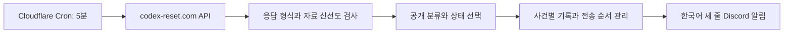

# codex-reset.com 전환 조사 및 개편 계획

작성일: 2026-09-21 KST. 현재 단계: 조사와 설계. 실제 코드·배포·알림 변경은 포함하지 않는다.

## 구현 승인 및 진행 기록

### 0.8 운영 전환 — 사용자 명시 승인

완료: 실제 운영 0.8 UUID `c345010d-f306-4364-ad46-106b237dbf1a`를 트래픽 100%에 적용했다. 실 알림을 켜고 초기화·반복 처리·조회 간격 제어를 검증했으며, 최종 5분 Cron의 06:25:57 KST 실제 실행도 정상 확인했다. 상세 근거와 아직 증명하지 않은 범위는 [운영 검증 기록](verification/0.8-production.md)에 있다. 아래 승인 대기·시험판 상태는 이전 단계의 기록이다.

2026-09-21 사용자가 0.8의 운영 적용을 승인했다. 실행 순서는 다음과 같다.

1. 기존 0.7 운영 UUID와 비밀 값 이름을 확인하고 보존한다. 승인한 0.8 소스의 검사·시험을 실행한다.
2. 발송을 끈 0.8을 먼저 적용해 SQLite Durable Object를 만들고 실제 Cron의 API 읽기·기준 목록 저장을 확인한다.
3. 운영 설정에서 실제 감시 알림을 켠 0.8을 활성화한다. Discord 연결 시험은 계속 꺼 두며 추가 시험 메시지는 보내지 않는다.
4. 임시 1분 Cron의 정상 실행을 연속 3회 확인한다. 조회 간격 제한으로 생기는 정상 건너뜀과 실제 자료 읽기를 구별한다.
5. 성공·실패와 관계없이 최종 5분 Cron을 복구한다. 같은 운영 UUID의 최종 5분 실행, 배포 비율·바인딩·인증 보호를 확인한다.
6. 운영 결과를 문서에 반영하고 앞선 보관 요청을 이어 설정·기록을 커밋·푸시한다. X 비밀 값·기존 KV는 안정 관측과 되돌리기를 위해 보존한다.

### 0.8 진행 상황 원격 보관 — 사용자 요청

2026-09-21 사용자가 시험 성공을 확인하고 버전 정리·커밋·원격 푸시를 요청했다. 구현과 승인된 연결 시험은 완료됐으며, 0.8 운영 적용·실 Cron·24시간 관측은 아직 별도 승인·검증 단계다. 동일한 개편 묶음이므로 이미 부여한 제품 0.8 / npm 0.8.0을 유지한다.

1. 원격·현재 브랜치·변경 범위를 확인한다.
2. 완료 상태를 문서에 반영하고 최종 검사 및 민감 값 혼입 검사를 한다.
3. 소스·시험·설정·계획·검증 기록만 커밋하고 현재 원격 브랜치에 정상 푸시한다. 임시 파일·비밀 값·백업·node_modules는 포함하지 않는다.
4. 원격 커밋 일치와 작업 폴더 상태를 확인한다. 운영 배포와 stable 태그 생성은 하지 않는다.

2026-09-21 후속 요청으로 아래 구현을 승인받았다. **실제 Discord 시험 메시지는 발송 직전에 멈추고 사용자 허락을 받는다.** 아래 기록이 위의 최초 조사 범위보다 우선한다. 운영 전환 승인은 별도다.

1. 기존 미커밋 작업의 파일 사본을 보관한다.
2. 0.8 API·사건 선택·순차 저장·Discord 모듈과 안전한 기본 설정을 구현한다.
3. X 의존 경로를 제거하고 설명서·설정·버전을 갱신한다.
4. 가짜 Discord 응답으로 단위 시험과 격리된 Worker 실행 시험을 완료한다. 공개 사이트 읽기만 실제 요청한다.
5. 결과와 실제 보낼 시험 메시지를 제시한 뒤 Discord 시험 허락을 요청한다. 허락 전 실제 전송·운영 전환은 하지 않는다.

### 현재 구현 상태

후속 결과: 승인된 실제 Discord 시험 1건의 생성 응답과 본문 재조회를 확인했다. 운영 0.7은 변경하지 않았다. 상세 영수증과 증명 범위는 `verification/0.8-implementation.md`의 후속 승인 시험 완료 절을 따른다.

2026-09-21 사용자가 실제 Discord 연결 시험 1건을 승인했다. 운영 적용은 승인되지 않았다. 기존 Worker의 비밀 값을 외부로 꺼내지 않도록, 해당 Worker의 **운영 미적용 immutable 버전**에 짧게 유효한 인증 해시로 보호한 시험 진입점만 업로드한다. 이 진입점은 0.8의 실제 Discord 전송 모듈을 사용하며, 별도 시험 전용 KV 키에 전송 시도·결과를 기록한다. 요청은 단 한 번 실행하고, 불명확한 결과는 읽기 전용 영수증 확인만 허용한다. 인증 원문은 메모리에만 두고 생성 파일은 정리한다. 운영 배포 UUID를 전후 비교한다. 이는 기존 STATE를 사용하는 시험 도구의 한정된 예외이며 새 정기 감시 코드의 저장 방식은 바꾸지 않는다.

- 0.8 소스와 파일별 개편 완료. 자세한 실제 결과는 [검증 기록](verification/0.8-implementation.md)에 있다.
- `npm run check`, 36개 자동 시험, Wrangler 빌드 확인 완료. 가짜 Discord만 사용했다.
- 격리된 무Cron·무발송 Cloudflare 시험판에서 실제 API 56개 항목을 정상 확인했다. 임시 진단 토큰은 제거했다.
- 운영 0.7 UUID와 트래픽은 유지했다. 실제 Discord 시험 허락을 요청하는 지점에서 멈춘다.
- 아래의 최초 조사·제안은 설계 근거로 보존한다. 현재 구현·검증 상태는 이 절과 검증 기록이 우선한다.

## 조사 순서

1. 사이트의 개발자 문서, 공개 API, 데이터 재사용 조건을 확인한다.
2. 실제 API 응답의 필드, 시간, 상태, 캐시·갱신 정보를 문서와 비교한다.
3. 현재 Worker의 수집·판정·시간 계산·상태 저장·Discord 전송을 조사한다.
4. 교체 구조, 알림 기준, 이전 자료 재발송 방지, 실패 처리, 파일별 변경과 검증·전환 절차를 설계한다.
5. 확인한 사실과 제안, 아직 검증하지 않은 사항을 구분해 이 문서를 완성한다.

## 범위

- X API 및 게시물 의미·시간 해석을 없애고 사이트가 제공하는 구조화된 정보로 전환하는 계획.
- 기존에 수정되었거나 추가된 사용자 파일은 보존한다.
- 이번 작업에서는 운영 Worker, Cron, KV, 비밀 값, Discord를 변경하지 않는다.

## 결론

공개 JSON API가 있으므로 HTML 수집은 필요 없다. **`GET /api/timeline`을 알림의 유일한 사건 목록으로 사용하는 전환**을 권장한다. 우리 앱은 사이트의 분류를 받아서 새 항목인지 확인하고 한국어로 전달한다. X 호출, 게시물 본문 해석, 상대 시간·미국 시간 추정은 제거한다.

다만 이는 단순한 주소 교체가 아니다. 정보의 판단 주체가 Tibo 게시물을 직접 읽는 우리 코드에서 독립 커뮤니티 사이트로 바뀐다. 사이트는 지연·오분류·누락 가능성을 명시한다. 개인 계정 사용량을 확인하는 서비스도 아니다. 알림은 **사이트에 등록된 발표**를 알려야 하며, 실제 계정의 리셋 완료나 정확한 적용 순간을 보장해서는 안 된다.

사용자가 이번 조사 중 선택한 알림 범위는 **리셋 발표 + 사용량 확대 + 리셋권 안내**다. 확률 예측, 모델 공개, 장애 알림은 제외한다. 사이트의 credits 분류는 일반 크레딧도 포함할 수 있어, 문서화된 저장형 리셋권 상태가 명시된 경우만 알리고 나머지는 보류하는 안이다.

## 확인한 정보와 공개 경로

조사 환경: 사용자 Windows PC의 PowerShell 및 Node.js HTTPS 요청. 확인 시각은 2026-09-21 05:30~05:32 KST 부근이다. API 키 없이 식별용 User-Agent를 붙인 공개 GET 요청이 성공했다. Cloudflare Worker에서의 접근은 아직 시험하지 않았다.

| 경로 | 제공 정보 | 개편에서의 역할 |
| --- | --- | --- |
| `/api/timeline` | 날짜·종류·식별자·요약·출처가 있는 사건 목록 | 정기 수집의 주 경로 |
| `/api/feed` | Tibo 게시물, 수집 시각, 오래된 자료 여부, 현재 신호 | 문제 진단용. 본문 재분석이나 추가 알림 경로로 사용하지 않음 |
| `/api/forecast` | 24·48시간 확률, 신뢰도, 마지막 리셋 시각, 공식 신호 | 선택적 상태 확인. 확률만으로 리셋 알림 금지 |
| `/api/status-history` | Codex 서비스 상태와 90일 장애 이력, 보상 연결 | 향후 별도 장애 기능 후보 |
| `/mcp` | 읽기 전용 도구 3개: 예측·사건 목록·서비스 상태 | 사람이나 에이전트용. 단순 Worker에는 직접 JSON 호출이 적합 |
| `/feed.xml` | Atom 형식 발표 목록 | 실제 JSON 목록과 최신 항목이 달라 기본·장애 대체 경로로 채택하지 않음 |

사이트 화면은 개인 5시간·주간·저장형 리셋권 타이머, 사용량 분석, 리셋권 사용 가치 계산, 시간대별 이력과 예측, Tibo 소식, 서비스 장애, 알림 채널을 제공한다. 개인 타이머와 붙여 넣은 사용량 분석은 브라우저 안에서 작동하며 우리 Worker가 사용자의 실제 잔여량을 가져올 수 있는 API가 아니다.

추가 카탈로그에는 `/api/juice`, `/api/effort-evidence`, `/api/usage-reference`, `/api/pray`도 있다. 이번 알림과 무관하며, 모델 관측 화면인 Codex Juice는 갱신 종료 상태라고 안내한다. 이 경로의 실제 데이터 검증은 하지 않았다. 공개 입력용 POST 경로는 통합 계약에 포함되지 않으므로 사용하지 않는다.

사이트 자체 Telegram·Discord·이메일·브라우저 알림도 있다. 우리 Discord 전송을 유지하면 한국어 형식과 중복 방지 정책을 통제할 수 있다. 사이트 자체 알림과 정확히 같은 결과를 복제하는 API 계약은 확인되지 않았다.

근거: [개발자 문서](https://codex-reset.com/developers), [사이트 안내](https://codex-reset.com/llms-full.txt), [API 카탈로그](https://codex-reset.com/.well-known/api-catalog), [MCP 설명](https://codex-reset.com/.well-known/mcp/server-card.json).

## API 계약과 실제 응답의 차이

### 안정적으로 의존할 부분

개발자 문서는 아래 조건을 일반 리셋 신호로 지정한다.

```js
event.group === "reset" && event.announcement_state === "announced"
```

문서에서 안정적인 필드로 명시한 사건 식별자 `id`, 발표 시각 `announced_at`, 발표 상태 `announcement_state`, 분류 `group`·`type`, 요약 `summary`, 출처 `url`에 의존한다. 새로운 필드가 추가되어도 무시하고, 필요한 필드가 없어지거나 알 수 없는 상태가 오면 알림을 보류한다. 식별자는 숫자 연산이나 BigInt 정렬의 대상이 아닌 불투명한 문자열로 취급한다.

저장형 리셋권은 `banked_state`의 `announced`, `arriving`, `available`, `unknown`을 별도 사실로 다룬다고 설명한다. 저장형 리셋권 지급은 일반 사용량 리셋으로 계산하지 않는다. 문서는 이 상태의 의미를 설명하지만 모든 credits 항목에 존재한다고 보장하지 않는다.

### 실제 관측

`/api/timeline` 응답은 56개 사건으로 구성되었다. `reset` 42개, `credits` 7개, `boost` 6개, `unlock` 1개였다. 56개 중 `announcement_state`가 `announced`인 항목은 7개, `none`은 3개, 나머지 46개는 이 필드가 없었다. 따라서 **목록에 있다는 이유만으로 전체를 확인된 리셋으로 보내면 안 된다.** 과거 기록 수와 지금 알림 조건을 통과하는 수는 다르다.

다음은 원문을 저장하지 않은 필드 관측 요약이다.

| 사례 ID | 실제 필드 | 의미와 설계 영향 |
| --- | --- | --- |
| `2098685367058612394` | reset / announced, 2026-09-12T08:09:17Z | 문서상 리셋 신호. 발표 시각 KST는 2026-09-12 17:09 |
| `2098612714704891959` | reset / none | reset 분류만 검사하면 불필요한 알림 가능 |
| `2097752790177370535` | credits, banked_state=unknown | 지급 완료나 자동 리셋으로 표현하면 안 됨 |
| `2097043464538264003` | reset / announced, source=operator-observed | 사이트 이력의 시각이 원본 게시 시각과 같다고 가정할 수 없음 |
| `2087706104814023111` | reset / announced, official_window가 미래 마감 구간을 담음 | announced만으로 ‘완료’라고 부를 수 없음 |

모든 56개 항목의 `effective_at`은 null이었다. 9개에는 `official_window`가 있었지만 구간·마감 표현이 포함되어 정확한 적용 시각과 같지 않다. 두 필드는 개발자 문서의 안정 필드 목록에 없다. **초기 버전은 이 필드를 읽어 적용 시간을 복원하지 않는다.**

`/api/feed`의 게시물에서는 같은 사건이 `candidate` 또는 검증 만료 상태인 반면, timeline에서는 announced로 나타나는 경우가 있었다. `/api/forecast`에는 `latest_alert`, `alert_event_id`, `signal_tier`도 보였지만 안정적인 공개 계약으로 명시되지 않았다. 이 내부 필드를 섞어 독자 판정을 만들지 않는다.

예측 응답의 마지막 리셋은 2026-09-12T08:09:17Z였고 신뢰도는 low였다. 이는 조사 시점의 관측이며 고정된 제품 사실이 아니다. `last_reset_at`만 저장하는 방식은 한 번에 여러 사건이 생기거나 이전 항목이 정정될 때 정보를 잃으므로 timeline의 개별 ID를 사용한다.

Atom 응답의 최상단 갱신 시각은 2026-09-08T01:34:00Z였다. 같은 조사에서 JSON timeline의 최신 리셋은 9월 12일이었다. 원인은 확인하지 않았지만, 두 형식이 항상 같은 목록이라는 가정은 이 관측으로 성립하지 않는다.

근거: [timeline](https://codex-reset.com/api/timeline), [feed](https://codex-reset.com/api/feed), [forecast](https://codex-reset.com/api/forecast), [Atom](https://codex-reset.com/feed.xml).

## 갱신·접근·재사용 조건

- 무료, 인증 키 없음. 공개 JSON은 CORS를 허용하지만 서버에서 실행하는 Worker에는 브라우저 CORS 설정이 필요하지 않다.
- 개발자 문서는 분당 1회보다 자주 조회하지 말라고 안내한다. 기존 5분 Cron은 유지 가능하며 하루 288회 주 API 요청이 된다. 사이트 수집·분류 지연이 추가되므로 ‘5분 안에 반드시 알림’은 보장하지 않는다.
- 게시된 복사본은 약 1분마다 갱신된다고 설명하지만, 화면 하단은 원본 게시물 확인을 약 2분 간격이라고 별도로 표시한다. 게시본 갱신과 새 게시물 수집은 같은 단계가 아니다.
- timeline·forecast 실제 응답은 `Cache-Control: public, max-age=60`이었다. status-history는 실제로 max-age=300이었다. 모든 경로의 캐시 시간을 동일하게 고정하지 않는다.
- `x-published-checked-at`, `x-published-expires-at`으로 게시본 유효성을 판단한다. 관측한 timeline 게시본의 확인·만료 간격은 3분이었다. 이는 서비스 보장값이 아니며 응답 헤더를 읽어야 한다.
- HTTP 429에서는 `Retry-After`를 따른다. 더 빠른 재시도로 우회하지 않는다. 인증·유료 구독·페이지 수집으로 우회하는 경로도 추가하지 않는다.
- 서버 요청의 User-Agent에 프로젝트 이름과 연락 가능한 주소가 필요하다. 예: `TiboCodexMonitor/0.8 (+<공개 프로젝트 또는 연락 URL>)`. 조사 요청에는 기존 공개 Worker URL을 식별값으로 썼다. 실제 운영용 주소가 연락 경로로 충분한지는 배포 전에 정한다.
- 다른 사람에게 보여 주는 메시지에는 사이트 이름과 링크를 함께 표기한다. 개발자 문서는 개인 스크립트·자기 휴대전화·팀 채팅에 표시 면제를 적지만, 제안 메시지는 공개·비공개 여부에 상관없이 출처를 넣는다.
- 운영자에게 문의하거나 메시지를 보내지는 않았다. 문서에서 가용성 보장, 완전한 변경 이력, 안정적인 페이지 나누기·변경 커서·수신 웹훅 계약은 확인되지 않았다.

근거: [개발자 문서](https://codex-reset.com/developers), [이용 조건](https://codex-reset.com/terms). 예측은 [방법 설명](https://codex-reset.com/forecast-method)에서도 실제 계정 관측과 구별된다.

## 제안하는 알림 정책

| 종류 | 전송 기준 | 한국어 제목 | 기본값 |
| --- | --- | --- | --- |
| 일반 리셋 | group=reset 및 announcement_state=announced | Codex 리셋 발표 감지 | 켬 |
| 사용량 확대 | group=boost | Codex 사용량 확대 안내 | 켬 |
| 저장형 리셋권 | group=credits 및 banked_state가 announced, arriving, available 중 하나 | Codex 리셋권 지급 예고 / 지급 진행 / 사용 가능 안내 | 켬 |
| 리셋권 상태 변화 | credits의 문서화된 banked_state가 announced→arriving→available로 전진 | 리셋권 지급 예고 / 지급 진행 / 사용 가능 안내 | 알려진 상태일 때만 추가 안내 |
| 모델·기능 공개 | group=unlock | 해당 없음 | 끔 |
| 예측·암시·일반 게시물 | 확률, feed.signal, 본문 키워드 등 | 해당 없음 | 끔 |
| 장애·복구 | status-history | 해당 없음 | 끔 |

reset에만 적용되는 announcement_state=announced 조건을 boost·credits에 복사하지 않는다. 실제 boost·credits에는 이 상태가 none이거나 없을 수 있다. 반대로 credits를 모두 저장형 리셋권이라고 단정하지 않는다. banked_state가 unknown이거나 없으면 보류한다. unknown으로 돌아가거나 분류가 흔들리는 것만으로 재알림하지 않는다. 따라서 관측한 9월 9일 사례처럼 사이트가 리셋권 상태를 확정하지 않은 공지는 새 정책에서 누락될 수 있다. 이를 살리기 위해 미문서화된 reset_kind나 본문 분석을 도입하지 않는다. 관련 credits 전체를 일반 안내로 넓히는 것은 별도 범위 변경이다.

리셋 예측 알림은 별도 선택 기능으로 남긴다. 83%·93% 등의 숫자만으로 사이트 자체 알림을 복제할 수 없다. 방법 문서상 같은 숫자가 보이는 문맥도 실제 알림 대상이 아닐 수 있고, alert 내부 필드는 안정 계약이 아니다. 이를 원하면 공개 `official_signal`의 구체적인 필드 계약이나 안정된 알림 API를 추가 확인해야 한다. HTML 문구 분석을 되살려 해결하지 않는다.

### 시각과 세 줄 형식 변경안

기존 완료·예정 단정과 ‘리셋 시각’을 일반적인 ‘발표’와 ‘발표 시각’으로 바꾼다. `announced_at`의 절대 시각을 `Asia/Seoul`로 표시하는 기능만 유지한다. 미래 시각이 되었다는 이유로 완료 알림을 새로 만들지 않는다.

```text
🚨 **Codex 리셋 발표 감지!**
**발표 시각(KST)**: 2026-09-12 17:09 KST
출처: https://codex-reset.com/ · https://fixupx.com/thsottiaux/status/2098685367058612394
```

위는 과거 자료로 만든 형식 예시이며 실제 발송하지 않았다. 실제 원본 게시 시각이라는 의미가 아니라 사이트가 사건에 부여한 발표 시각이다. 세 줄, 한국어, KST, 원문 미포함을 유지한다. FixupX는 유효한 X 게시물 URL에서만 미리보기 링크로 변환하고, 수집하거나 검증하는 데 쓰지 않는다. 지원하지 않는 출처 URL은 사이트 timeline 링크로 안내한다. 출처 사이트 링크는 항상 포함한다.

즉 이 전환은 ‘Tibo만 직접 검증’, ‘정확한 리셋 적용 시각’, ‘완료·예정 구분’이라는 기존 계약을 바꾸는 제안이다. 이번 계획 작성이 기존 운영 계약을 즉시 바꾸지는 않는다.

## 처리 구조



기본 네트워크 호출은 timeline 한 번이다. forecast·feed는 매번 추가 호출하지 않고 진단에만 사용한다. 서로 다른 API 응답은 게시 시각이 달라질 수 있으므로 한 번의 원자적인 자료처럼 합치지 않는다. HTML 추출, 브라우저 자동화, LLM, X API 대체 연결은 넣지 않는다.

### 응답 검사

1. 10초 요청 제한과 1 MiB 본문 상한을 제안한다. 현재 응답은 JSON 문자열 길이 약 11.8만 문자였고 차트용 HTML도 포함한다. 사용하지 않는 필드와 HTML은 버리며 실행·렌더링하지 않는다.
2. HTTP 성공·JSON 객체·events 배열·문서화된 필드의 자료형을 검사한다. 추가 필드는 허용하되 필수 필드 부재, 잘못된 날짜, 상충하는 같은 ID는 해당 사건을 보류한다. 최상위 구조 오류는 해당 수집 전체를 실패 처리한다.
3. checked-at과 expires-at은 유효한 절대 시각이어야 하고 현재 시각이 만료보다 뒤면 전송하지 않는다. 누락 시 자동으로 오래된 자료를 정상 취급하지 않고 진단한다. 미래 시계 오차는 최대 60초만 허용하는 기준을 시험한다.
4. ‘마지막 리셋이 오래전’과 ‘API 게시본이 오래됨’을 구별한다. 며칠 동안 리셋이 없어도 방금 확인한 정상 응답은 정상이다. `content_age_days`만으로 장애 판정하지 않는다.
5. events를 발표 시각과 ID로 안정 정렬하되 최대 ID·최대 시각 커서로 나머지를 버리지 않는다. 전체 목록의 각 ID를 기존 기록과 비교한다.

### 첫 실행, 중복, 지연, 수정

- 새 저장 영역은 `codex-reset:v1`처럼 X 상태와 구별한다. 기존 `last_seen_id`를 새 API 커서로 재사용하지 않는다.
- 첫 정상 응답은 기준 목록으로 저장하고 이미 있는 사건을 발송하지 않는다. 문서화된 일반 리셋 조건을 아직 충족하지 않는 최신 항목은 그 상태도 저장한다. 전환 후 상태가 announced로 바뀌면 별도로 평가한다.
- 첫 기준 목록에 이미 전송 가능한 항목은 모두 과거 자료로 처리한다. 초기화가 자료 저장까지 완전히 끝난 뒤에만 발송을 활성화한다. 미리보기용 저장 영역과 운영용 저장 영역은 공유하지 않는다.
- 기본 신선도는 기존과 같은 발표 후 1시간을 유지한다. 기준 목록에 없더라도 1시간이 지난 항목은 자동 발송하지 않고 보류 사유만 남긴다. 오래된 자료 추가나 90일 중복 기록 만료가 과거 알림 폭주를 일으키지 않게 한다.
- 이 정책은 사이트 등록이 1시간 늦거나 우리 서비스 장애가 길어지면 알림을 놓칠 수 있다. 전환 후 관측을 통해 24시간까지 늦은 알림을 허용하는 별도 정책을 검토할 수 있지만 초기부터 조용히 완화하지 않는다.
- 사건별 전송 단위는 ID와 허용된 알림 종류·상태 단계다. 요약 문장, 좋아요 수, 예측치, 정정된 시각을 전송 키에 넣지 않는다. 단순 편집으로 다시 보내지 않는다.
- 같은 ID가 none→announced로 변하면 1시간 조건 안에서 최초 리셋 알림을 보낼 수 있다. credits 상태의 전진은 상태별 한 번만 알리고, 되돌아감·unknown은 기록만 한다. 종류 자체가 바뀐 사건은 자동으로 다른 종류의 알림을 재발송하지 않고 검토 대상으로 남긴다.
- 서로 다른 ID가 실제로 같은 전 세계 리셋을 가리키는지는 문서화된 사건 묶음 ID가 없어 보장할 수 없다. 원문 유사도·시간 근접도로 합치면 의미 판정이 되살아난다. 기본 중복 방지는 사이트 항목 단위임을 명시한다.
- 목록에서 사건이 사라져도 전송 기록을 지우지 않는다. 같은 사건이 재등장해도 재발송하지 않는다. 삭제·정정 이력이 공개되지 않으므로 정정 알림을 완전하게 보장할 수 없다.

### 저장과 전송의 실패 경계

현재 KV는 상태를 빠르게 배포하지만 겹친 실행 사이의 잠금이나 원자적 전송을 보장하는 저장소가 아니다. 이번 전환의 권장안은 **단일 Durable Object를 전송 담당으로 두는 것**이다. 이는 Cloudflare 안에서 사건 기록과 발송을 한 순서로 처리하는 작은 구성 요소다. X 관련 KV는 되돌리기 기간에 그대로 보존하고 새 작업에서는 읽지 않는다.

Durable Object 안에서도 await 사이에 실행이 겹칠 수 있으므로 명시적 처리 대기열과 트랜잭션으로 claim을 기록한다. 전송 상태는 pending → attempting → sent, 또는 delivery-unknown으로 구별한다. 단순히 ‘Durable Object를 썼으니 한 번만 발송된다’고 주장하지 않는다.

Discord는 `wait=true` 응답으로 메시지 ID를 받아 sent 기록에 저장한다. 429는 재시도 시각을 저장한다. 명확한 거절은 오류로 기록한다. 네트워크 단절, 일부 서버 오류, Discord 성공 후 저장 실패는 이미 전송되었는지 불명확할 수 있다. 이 경우 자동 재전송을 보류하고 확인 대상으로 남긴다. Discord와 저장소를 하나의 트랜잭션으로 묶을 수 없으므로 ‘절대 누락도 중복도 없음’은 약속하지 않는다.

성공할 때마다 KV에 heartbeat를 쓰지 않는 기존 원칙은 유지한다. 정상 수집 결과는 Observability에 간단히 남기고, 지속 저장은 사건 상태 변화·전송 영수증·오류·재시도 제어에 한정한다. 본문·비밀 값은 로그에 남기지 않는다. 사용자 메시지에는 `allowed_mentions: { parse: [] }`를 적용한다.

Durable Object 사용 가능 여부, 저장 한도·요금 영향, 실제 Worker 네트워크 접근은 구현 단계에서 확인한다. 이를 채택하지 않고 KV만 유지하는 축소안은 가능하지만 겹친 실행의 중복 위험을 수용해야 하며 같은 보장으로 설명해서는 안 된다.

## 파일별 변경 계획

| 파일 | 작업 |
| --- | --- |
| `src/index.js` | monitor를 timeline 기반으로 재작성. X 조회·캐시·페이지 처리·문맥 관리·분류 재수출 제거. Cron 및 보호된 `/run` 유지 |
| `src/source.js` 신설 | API 요청, User-Agent, 시간 제한, 크기 제한, 응답 검사 |
| `src/events.js` 신설 | 문서화된 필드만 사용하는 사건 정규화와 알림 선택. 자연어 해석 없음 |
| `src/delivery.js` 신설 | Durable Object 상태, 초기 기준 목록, 순차 전송·재시도·전송 영수증 |
| `src/discord.js` 신설 | 세 줄 문구, 출처 링크, mentions 방지, Discord 응답 처리 |
| `src/classifier.js` | 새 구현 검증 후 제거 |
| `src/time.js` | KST 표시만 남기고 상대 시간·Pacific 시간 문장 분석 제거 |
| `src/post-utils.js` | X 전용 중복 제거 사용처가 없어지면 제거 |
| `scripts/recover-approved-post.js`, `scripts/recovery-entry.template.js`, `scripts/run-approved-recovery.js` | X 의존 운영 경로에서 제거. 이전 복구 기록은 문서·버전 기록으로 보존 |
| `test/logic.test.js`, `test/timeline.test.js`, `test/incident.test.js`, `test/recovery.test.js` | X·문장 판정 시험을 새 API·상태·전송 시험으로 교체. 과거 누락은 새 구조의 회귀 사례로 변환 |
| `package.json`, `package-lock.json`, `src/version.js` | 다음 주요 개편 후보 0.8 / npm 0.8.0 동기화. 검사·시험 목록 갱신 |
| `wrangler.jsonc` | 5분 Cron 유지, 새 저장 구성 추가, 운영 비밀 값은 넣지 않음 |
| `README.md`, `AGENTS.md`, `VERSION_HISTORY.md` | 새 정보 출처·시각 의미·세 줄 출력·오류 한계·되돌리기 절차 기록. AGENTS의 Hive 사용자 블록은 수정하지 않음 |

현재 작업 폴더에는 0.7 관련 미커밋 수정과 복구 스크립트가 이미 있다. 구현 전 이 변경들을 보존한 기준점을 확정한다. 기존 코드를 clean 상태로 되돌리거나 무조건 덮어쓰지 않는다. 현재 npm test는 recovery.test.js를 포함하지 않으므로 새 시험 파일은 실행 명령에 반드시 포함시킨다.

실제 운영 소스는 공식 X API와 JavaScript 분류이며 HTML 수집 코드는 확인되지 않았다. 계획에서 ‘제거’는 X와 분류 전체를 가리키며 존재하지 않는 수집 코드를 새로 가정하지 않는다.

## 단계별 구현과 완료 조건

1. **계약 확정:** 알림 범위, 발표 시각 문구, 출처 표시, 1시간 정책을 이 문서 기준으로 확정한다. 현재 사용자 요청은 계획까지이며 구현·발송·배포는 아직 수행하지 않는다.
2. **자료 읽기 구현:** 개인정보·게시물 원문을 제거한 최소 시험 자료를 만들고 API 모듈과 형식 검사를 구현한다. 새 코드가 X 및 HTML을 호출하지 않는지 시험한다.
3. **사건·전송 구현:** 초기화와 상태 변화를 구현하고, Discord는 가짜 응답으로 시험한다. 단위 시험과 Worker 실행 환경 시험에서 모두 부작용 없는 진단 모드를 검증한다.
4. **0.8 시험판 검증:** 구현 요청이 온 뒤 번호가 붙은 시험판을 만든다. 별도 저장 영역·발송 꺼짐 상태로 실제 API를 관측한다. 24시간 관측과 최소 3회 연속 정상 실행을 제안한다. 이 단계에서 기존 운영 Cron은 계속 동작한다. 두 구현이 동시에 실제 Discord로 보내지 않게 한다.
5. **운영 전환:** 0.8의 변경·시험 결과를 제시한 뒤 해당 버전 운영 배포에 대한 명시 승인을 받아 전환한다. 기준 자료를 먼저 채우고 전송을 켠다. 실 Cron 확인이 필요하면 1분 간격으로 일시 변경하되 API당 분당 1회 한도를 지키고 마지막에 반드시 5분으로 복구·검증한다.
6. **되돌리기와 정리:** 이전 배포 버전과 X 비밀 값·KV는 되돌리기 기간에 보존한다. 새 경로 안정 확인 뒤 X_BEARER_TOKEN 제거와 옛 상태 정리를 별도 명시 작업으로 수행한다. X 유료 서비스 해지는 코드 삭제와 별개이며 사용자 계정에서 처리 여부를 확인해야 한다.

되돌릴 때는 새 전송을 먼저 끄고 이전 버전을 복원한다. 전환 중 사이트가 보낸 X ID의 기록을 이전 `notified:` 키와 대조해 1시간 안의 재전송을 막는다. X 재호출은 되돌리기 때만 쓰는 이전 버전의 동작이며 새 앱의 자동 대체 경로가 아니다. 비밀 값을 삭제한 뒤에는 즉시 되돌릴 수 없으므로 정리를 먼저 하지 않는다.

### 필요한 시험

- reset+announced만 통과; reset+none·필드 누락은 보류; boost와 알려진 banked_state의 credits는 별도 제목, 일반 credits와 unknown은 보류.
- 전체 이력으로 첫 실행해도 0건 전송; 새 항목 한 번, 같은 항목 반복 0건, 삭제 후 재등장 0건.
- 기존 최신 항목의 none→announced, credits 상태 전진·역행·unknown, 요약 수정, ID 재분류.
- 1시간 경계, 미래 시각, 발표 시각 KST 변환, 시각 부재, 1시간 이상 수집 지연.
- 만료 헤더·JSON 구조 오류·HTML 오류 페이지·큰 본문·timeout·429·503에서 정상 알림과 상태 오염이 없는지.
- 한 수집의 여러 항목 중 중간 실패, 실행 겹침, Discord 성공 뒤 저장 실패, 불확실한 응답에서 중복과 누락의 경계 확인.
- 보호된 `/run`의 미설정·잘못된 토큰은 401. 새 진단 모드는 기본적으로 실제 메시지를 보내지 않음.
- X API·HTML 수집·classifier 호출이 없고 Discord가 정확히 세 줄이며 출처 링크·KST·mentions 차단을 갖는지.
- `npm run check`, 전체 `npm test`, 격리된 Worker 실행·저장 시험. 운영 배포 후 별도로 Cron·바인딩·비밀 값 이름과 5분 복구를 확인.

## 이번 조사 결과의 증명 범위

| 상태 | 범위와 실제 실행 | 증명하는 것 / 증명하지 못하는 것 |
| --- | --- | --- |
| 확인 | Windows에서 문서·timeline·feed·forecast·status-history·카탈로그·Atom 공개 읽기 | 무인증 API 접근과 관측한 응답 구조 / 미래 가용성·새 리셋의 탐지 지연은 미증명 |
| 확인 | 로컬 코드·설정·시험 실행 목록 읽기 | 현재 소스의 X·분류 의존과 변경 대상 / 현재 배포본이 로컬과 같은지는 미증명 |
| 확인 | API 필드와 개발자 계약 비교 | 정확한 적용 시각과 완료·예정 구분을 그대로 유지할 수 없다는 설계 근거 / 모든 미래 사건의 품질은 미증명 |
| 미실행 | Cloudflare에서 새 API 호출·새 저장 구성·Discord 발송·Cron 시험 | 이번에는 계획만 요청되어 실행하지 않음. 실제 호스트 동작은 구현 후 검증 필요 |
| 미실행 | 기존 앱 단위 시험·배포 | 소스 변경이 없어 이번 조사 범위에서는 실행하지 않음. 기존 시험 통과를 주장하지 않음 |
| 미실행 | MCP 도구 호출·보조 API·장기 관측 | 문서·카탈로그만 확인한 항목은 실제 동작을 확인했다고 주장하지 않음 |

남은 구현은 후속 요청의 범위다. 기술적으로 즉시 계획할 수 있는 작업은 위에 모두 정리했다. 운영 전환은 버전별 사용자 권한이 필요하고, 사이트 미래 계약·발표 품질·장기 가용성은 외부 근거에 달려 있다. 이번 계획 문서에는 해결되지 않은 코드 작업이 포함되지 않는다.

## 지식 기록 범위 검토

이번 결정의 범위는 current-project다. 이 프로젝트는 현재 Hive 프로젝트 등록 목록에 없고 사용자 전역 선호로 일반화할 수 없는 전환 요청이므로 user-root 지식으로 승격하지 않는다. 정본 작업 문서는 이 파일로 남기고, 모호한 프로젝트 지식 저장은 수행하지 않는다.
